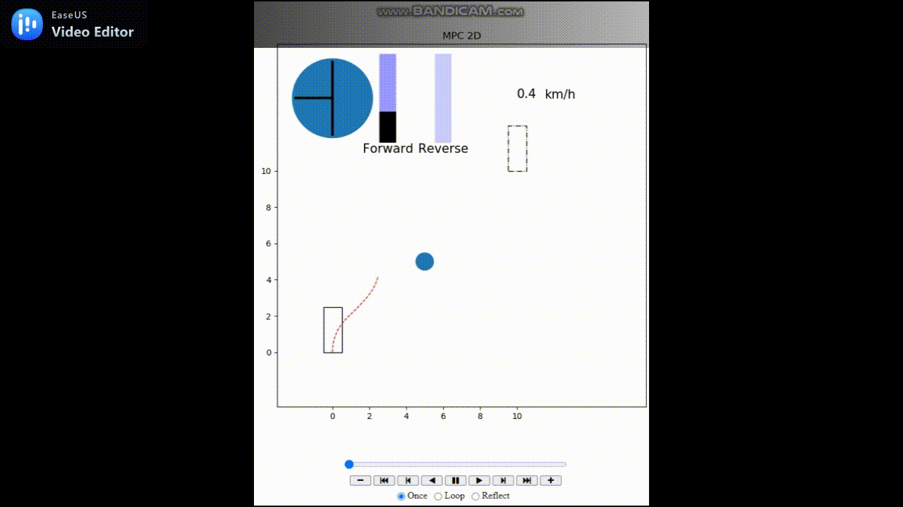
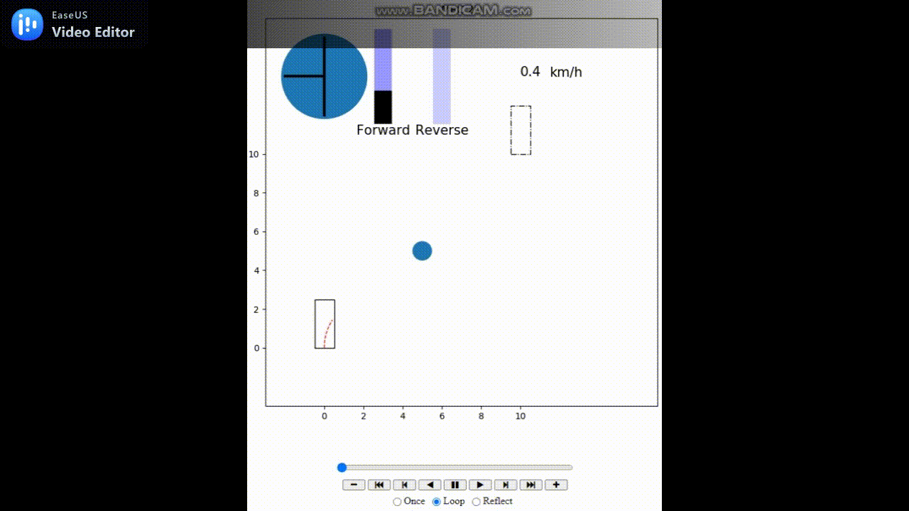

# Autonomous Robots: Model Predictive Control
Course link: www.udemy.com/course/model-predictive-control/  

Simple implementation of a Model Predictive Control [MPC] algorithm based on a bicycle modeling.
Various factors are taken in account to make the cost function which is subjected to a minimization during maneuvers :  
	## position cost
	to get to the target destination with the right linear position (x, y)  
	
	## angular cost
	to get to the target destination with the right heading angle (theta)  

	## longi accel cost
	to help avoid dangerous acceleration  

	## yaw rate cost
	to avoid dangerous angular acceleration  

	## obstacle cost
	to help avoid obstalce  

# Demo Video

